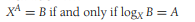
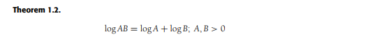
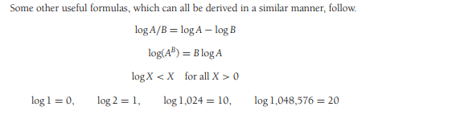

# 1.2 数学知识复习

## 1.2.1 指数

### 指数的定义

百度百科：

> 指数是幂运算 aⁿ(a≠0) 中的一个参数，a 为底数，n 为指数，指数位于底数的右上角，幂运算表示指数个底数相乘。当 n 是一个正整数，aⁿ 表示 n 个 a 连乘。当 n=0 时，aⁿ=1。

### 指数公式记忆

- 同底数相乘，指数相加
- 同底数相除，指数相减
- 幂运算的幂运算，指数相乘
- 幂运算相加，表示 2 倍幂运算，不等于 2 倍指数
- 底数为 2 的幂运算相加，表示指数 + 1

## 1.2.2 对数

**在计算机科学中，除非有特别的声明，否则所有的对数都是以 2 为底的。**

### 定义 1.1

指数转为对数的情况，就是底数下沉，指数与结果交换。

### 定理 1.1

### 定理 1.2

### 其他公式

